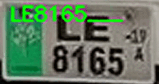

<!-- Animated Logo and Badges -->
<p align="center">
  
  <br/>
  <sup><b>X</b> = <span style="color:#06B6D4;font-weight:bold;">Xtreme</span></sup>
</p>

<p align="center">
  
   
  
  
  
  
</p>

---

# 🌌 X<sup style="color:#0d7bd6;font-weight:600; font-family: 'Open Sans', sans-serif;">treme</sup>Fast: An Automatic License Plate Recognition System built for blazing speed on edge devices with CPU-only inference.


<div align="center">
  
  
  
  
  
  
  
  
  
</div>


<br>

> **XFAST-ALPR** is an ultra-fast, production-grade ALPR system built for real-time, high-accuracy vehicle and license plate recognition. Featuring custom-designed detection and OCR models, it outpaces industry standards. RapidOCR and EasyOCR are included only for benchmarking—**the core engine is 100% custom and optimized for speed and accuracy**. 
<br>

---

<h2 align="center">🎬 Micro-Plates, Macro-Speed: OCR in Action</h2>

<p align="center">
  
</p>

<p align="center">
  
</p>

---

## ✨ Key Features

<details>
<summary><b>🚀 Xtreme Speed & Accuracy</b></summary>
<ul>
  <li>⚡ <b>Custom Detection Model</b>: Designed for real-time vehicle and plate detection, optimized for edge and cloud.</li>
  <li>🧠 <b>Custom OCR Engine</b>: Tailored for license plates, surpassing generic OCRs in speed and accuracy.</li>
  <li>🔬 <b>Benchmarking</b>: RapidOCR and EasyOCR included for transparent, reproducible performance comparison.</li>
  <li>🎥 <b>Camera & Video Support</b>: RTSP, USB, and file input with seamless switching.</li>
  <li>🖼️ <b>Smart Cropping</b>: Only the best, most confident crops per vehicle are saved.</li>
  <li>📊 <b>Performance Logging</b>: Automated benchmarking and result logging to text and Excel.</li>
  <li>🌗 <b>Light/Dark Mode Ready</b>: UI and visualizations look stunning in any theme.</li>
  <li>🧩 <b>Extensible</b>: Modular codebase for easy integration of new models or features.</li>
</ul>
</details>

<details>
<summary><b>🧠 Technical Deep Dive</b></summary>
<ul>
  <li><b>Detection Pipeline:</b> Custom YOLO-based model, tuned for license plate and vehicle detection in diverse conditions.</li>
  <li><b>OCR Pipeline:</b> Proprietary OCR model, trained on real-world plates for maximum accuracy and speed.</li>
  <li><b>Benchmarking:</b> RapidOCR and EasyOCR are used only for comparison; our custom model is the default and fastest.</li>
  <li><b>Result Logging:</b> All detections are timestamped, confidence-scored, and logged to text and Excel.</li>
  <li><b>Visualization:</b> Real-time bounding boxes, FPS, and detection status overlays.</li>
</ul>
</details>

---

## 📊 Performance Benchmarks

| Model                | Example Output         | Time (s)   |
|----------------------|-----------------------|------------|
| <b>Custom OCR (XFAST)</b> | ['AQZ456___']            | <b>0.0108</b> |
| EasyOCR              | ['FAAKIII', 'AOZ 456']| 0.4526     |
| RapidOCR             | ['A0Z 456', 'FNlan']  | 1.2330     |

> <b>Fastest Model:</b> <span style="color:#06B6D4;font-weight:bold;">XFAST Custom OCR</span>  
> <sub>Refer to <a href="https://github.com/ankandrew">Mr. Andrés Ankandrew</a> for his invaluable contributions to the OCR Tech.</sub>
> <sub>See <code>performances.txt</code> for full logs and YOLO model summary.</sub>

---

## 🏗️ Project Structure

```text
XFAST-ALPR/
├── ALPR_2.0.py           # Main pipeline: detection, tracking, cropping, OCR
├── listener.py           # Plate image OCR, result logging, Excel export
├── motion_detector.py    # Standalone vehicle detection & cropping
├── RapidCheck.py         # OCR benchmarking utility
│
├── models/
│   ├── LPR-YOLO-best.onnx                # Custom YOLOv12-based detector
│   └── global_mobile_vit_v2_ocr.onnx     # Custom OCR model
│
├── assets/               # Demo GIFs, screenshots, videos
├── crops/                # Saved plate crops (auto-managed)
├── license_plates.txt    # Recent recognized plates (timestamped)
├── performances.txt      # Benchmark results
└── ...
```

---

## 🛠️ Installation

> **Requirements:**  
> Python 3.8+, OpenCV, Ultralytics YOLO, EasyOCR, RapidOCR, Pandas, openpyxl

```bash
# Clone the repo
git clone https://github.com/yourusername/XFAST-ALPR.git
cd XFAST-ALPR

# Install dependencies
pip install opencv-python ultralytics easyocr rapidocr-onnxruntime pandas openpyxl
```

> <b>Note:</b> For GPU acceleration, ensure CUDA is available for EasyOCR and your hardware supports ONNX.

---

## ⚡ Quick Start

```bash
python ALPR_2.0.py
```
- Choose camera or video file as input.
- Detected plates and crops are saved automatically.

---


## ⚡ Motion Detector: The Secret to Xtreme Speed

<details>
<summary><b>Why Motion Detection Matters</b> (click to expand)</summary>

<p>
  Our Custom and <b>Tailoured Motion Detector</b> is the unsung hero of XFAST-ALPR. By leveraging advanced background subtraction and contour analysis, it:
  <ul>
    <li>🎯 <b>Filters out static frames</b> — Only processes frames with actual vehicle movement, slashing unnecessary computation.</li>
    <li>🚀 <b>Enables ultra-fast inference</b> — The ALPR pipeline is triggered only when a vehicle is detected, maximizing CPU efficiency and throughput.</li>
    <li>🧠 <b>Edge-optimized</b> — Designed for real-time use on edge devices, ensuring high FPS even without a GPU.</li>
    <li>🔗 <b>Seamless integration</b> — Works hand-in-hand with the custom detection and OCR models for a smooth, end-to-end pipeline.</li>
  </ul>
  <br/>
  <b>Result:</b> <i>Lightning-fast, resource-efficient ALPR that doesn't waste a single CPU cycle.</i>
</p>
</details>

---

## 🧵 Multithreading: The Art of Parallel Speed

<details open>
<summary><b>🤹‍♂️ How Multithreading Supercharges XFAST-ALPR</b> (click to expand)</summary>
<br>
<p align="center">
  
</p>

<p>
  <b>XFAST-ALPR</b> doesn't just run fast — it runs <i>smart</i>. By leveraging Python's <code>threading</code> module, the system:
  <ul>
    <li>🔄 <b>Runs OCR and detection in parallel</b> — No waiting for one plate to finish before starting the next.</li>
    <li>⚡ <b>Keeps the UI and video feed ultra-responsive</b> — Detection, cropping, and OCR happen asynchronously, so the main loop never stalls.</li>
    <li>🧠 <b>Handles multiple vehicles/plates at once</b> — Each detection can spawn its own thread for OCR, maximizing CPU utilization.</li>
    <li>🛡️ <b>Prevents bottlenecks</b> — No single slow operation can block the real-time pipeline.</li>
  </ul>
</p>

<details>
<summary><b>🔍 See it in code</b> (click to reveal snippet)</summary>

```python
import threading

def get_ocr_result(crop_filename):
    try:
        threading.Thread(
            target=run_ocr,
            args=(crop_filename,)
        ).start()
    except Exception as e:
        print(f"Error starting OCR thread: {e}")
```
</details>

<p align="center">
  <i>Result: <b>Zero lag, maximum throughput, and a buttery-smooth ALPR experience.</b></i>
</p>

</details>

---

## 🎥 Full Pipeline Demo Video
<div align="center" style="margin-bottom:2em; height:100%; width:100%">
<p align="center">
  
https://github.com/user-attachments/assets/96da7ca9-2a8d-4b0d-a199-cc85e40959bc

  <em>XFAST-ALPR in action: Motion detection, plate cropping, and OCR in real time 🔥</em>
</p>
</div>
---

## 🖼️ Visual Gallery

| Processed Results [Excel Workbook] | Live Output Results |
|-----------|---------------------|
|  |  |

---

## 🧩 Extending & Customizing

<details>
<summary><b>🔧 Advanced Customization</b></summary>
<ul>
  <li><b>Add new OCR models:</b> Plug into <code>listener.py</code> or <code>RapidCheck.py</code>.</li>
  <li><b>Change detection thresholds:</b> Tune constants in <code>ALPR_2.0.py</code> and <code>motion_detector.py</code>.</li>
  <li><b>Export formats:</b> Easily extend to CSV, database, or cloud logging.</li>
</ul>
</details>

---

## 🤝 Contributing

Pull requests, issues, and feature suggestions are welcome!  
Please see [CONTRIBUTING.md](CONTRIBUTING.md) for guidelines.

---

## 📄 License

This project is licensed under the MIT License.

---

## 🙏 Acknowledgements

- [Ultralytics YOLO](https://github.com/ultralytics/ultralytics)
- [EasyOCR](https://github.com/JaidedAI/EasyOCR)
- [RapidOCR](https://github.com/RapidAI/RapidOCR)


---

<center><b>X</b><sup>treme</sup><b>Fast-ALPR</b> isn't just another license plate reader.
It's an art of Speed, Precision, and Elegance — fused 💖</center>

---

> ⚠️ **Notice** <i>
> This repository serves as a **public showcase** of my work on XFast-ALPR.  
> The actual production code and models are **not included** due to a binding **Non-Disclosure Agreement (NDA)**.  
> All code and assets here are either simulated, stripped down, or demonstrative only. </i>
